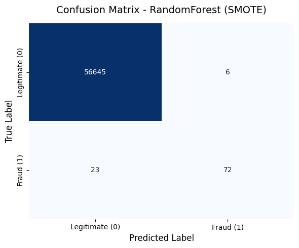

# End-to-End Credit Card Fraud Detection Pipeline

## Project Overview

This project focuses on detecting fraudulent credit card transactions using supervised machine learning techniques.

The main challenge addressed is the **extreme class imbalance** typically found in fraud detection datasets, where fraudulent transactions represent only a tiny fraction of the total observations.

The project implements an end-to-end workflow including:

- Data exploration and cleaning;
- Leakage-free preprocessing;
- Stratified train-test splitting;
- Class imbalance handling;
- Model comparison;
- Performance evaluation using fraud-oriented metrics;
- Confusion matrix analysis.

---

## Dataset

Dataset used:

**Credit Card Fraud Detection Dataset**

- Source: Kaggle (ULB Machine Learning Group)
- Total transactions: **284,807**
- Fraud cases: **492**
- Fraud prevalence: **0.172%**

---

## Technologies Used

- Python
- Pandas
- NumPy
- Scikit-learn
- Imbalanced-learn (SMOTE)
- Matplotlib
- Seaborn
- KaggleHub

---

## Methodology

### Data Preparation

- Missing value analysis;
- Duplicate detection;
- Stratified Train/Test split;
- RobustScaler for numerical variables;
- OneHotEncoder for categorical variables;
- Preprocessing fitted exclusively on the training set to prevent data leakage.

### Handling Class Imbalance

Two strategies were investigated:

- Class weighting;
- Synthetic Minority Oversampling Technique (SMOTE).

---

## Models Evaluated

1. Random Forest (Class Weight)
2. Random Forest (SMOTE)
3. Logistic Regression (Class Weight)
4. Logistic Regression (SMOTE)

---

## Evaluation Metrics

Because fraud detection is a highly imbalanced classification problem, traditional accuracy was intentionally avoided.

The following metrics were used:

- Precision;
- Recall;
- F1-Score;
- Area Under the Precision-Recall Curve (AUPRC).

---

## Results

| Model | Precision | Recall | F1 | AUPRC |
|---------|---------:|---------:|---------:|---------:|
| Random Forest (Class Weight) | 0.9855 | 0.7158 | 0.8293 | 0.8116 |
| **Random Forest (SMOTE)** | **0.9231** | **0.7579** | **0.8324** | **0.8135** |
| Logistic Regression (Class Weight) | 0.0564 | 0.8737 | 0.1059 | 0.6718 |
| Logistic Regression (SMOTE) | 0.0550 | 0.8737 | 0.1036 | 0.6728 |

The best-performing configuration was **Random Forest trained on SMOTE-balanced data**, achieving the highest AUPRC and F1-score.

---

## Confusion Matrix Analysis (Best Model)

Random Forest (SMOTE):

- Legitimate transactions correctly identified: **56,645**
- Fraudulent transactions correctly detected: **72**
- False positives: **6**
- False negatives: **23**

These results highlight the trade-off between minimizing missed fraud cases while maintaining a very low number of legitimate transactions incorrectly flagged as fraud.

---

## Business Perspective

In fraud detection systems, failing to identify fraudulent transactions (false negatives) may lead to direct financial losses.

At the same time, excessive false positives can negatively impact customer experience.

This project explores this balance by comparing multiple modelling approaches and selecting the configuration with the strongest overall performance.

---

## Disclaimer

This project was developed for educational and portfolio purposes.

The models presented are not intended for deployment in real-world financial environments without additional validation, monitoring, regulatory assessment, and production-grade safeguards.
